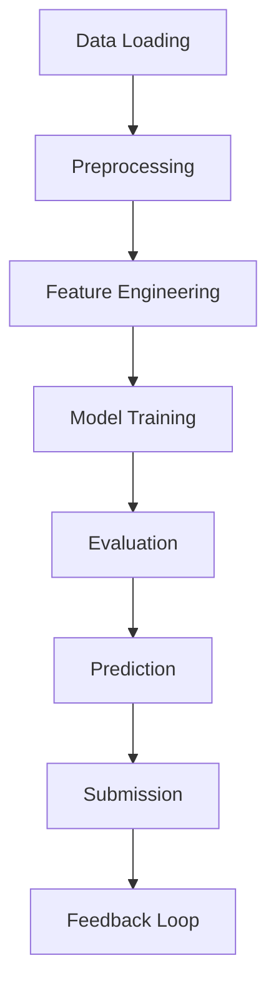

# System Patterns: Zindi Agriculture Competition

## System Architecture

The machine learning pipeline for crop classification follows this architecture:

## Key Components

### Data Loading

- Reading GeoTIFF satellite images using rasterio
- Loading GeoJSON files with field boundaries
- Handling metadata about crop types for training data

### Preprocessing

- Normalizing satellite bands to handle different value ranges
- Handling no-data values in satellite imagery
- Padding or cropping images to standardized dimensions
- Managing tile size variations across different fields

### Feature Engineering

- Computing vegetation indices (NDVI, SAVI, EVI) from spectral bands
- Extracting statistical features (mean, median, std, min, max) for each band
- Creating multi-temporal features to capture seasonal patterns
- Standardizing features for model input

### Model Training

- Splitting data into training and validation sets
- Implementing ensemble methods (Random Forest baseline)
- Cross-validation strategies for robust evaluation
- Hyperparameter tuning for optimal model performance

### Evaluation

- Metrics: Accuracy, F1-score, confusion matrix
- Validation against held-out data
- Visualizations of model performance across different crop types

### Prediction

- Applying trained model to test data
- Processing full test dataset efficiently
- Ensuring predictions match expected format

### Submission

- Creating submission file in required format
- Validating submission against sample format
- Preparing final output for competition platform

## Technical Decisions

- Using Random Forest as baseline model (shown effective in remote sensing applications)
- Extracting statistical features rather than using raw pixel values
- Leveraging vegetation indices which are proven in agricultural classification
- Processing satellite imagery as tiles to handle memory constraints

## Component Relationships

- Preprocessing directly impacts feature quality
- Feature engineering complexity balanced against model complexity
- Multi-temporal approach requires consistent preprocessing across time periods
- Model selection influenced by interpretability requirements and computational constraints
